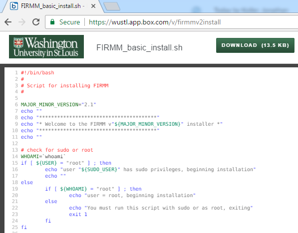

Version 2.1 written by Eric Earl (OHSU), Jon Koller (WUSM), Rachel Klein (OHSU), and Andrew Van (WUSM).

# Prerequisites for installation

Either an Ubuntu or CentOS Linux system capable of running Docker and Samba.

**NOTE**: *FIRMM has been tested with these two operating systems by communicating DICOMs over the same network from a SIEMENS scanner to the FIRMM system using a Samba mount.  Basic Samba configuration and installation are included in FIRMM installation.  Automatic Docker install and configuration only included for Ubuntu 14+ and Redhat 7 systems.*

# Download & Install

Log in or `ssh -X` to your Linux machine of choice (Ubuntu 14+ or Redhat 7+ recommended).

## Download

Get FIRMM's installation package by either of the following two methods:

**1. Web browser method**

- Point your browser to **[the NITRC page for FIRMM](http://www.nitrc.org/projects/firmm)**, click "Downloads" on the left-hand menu and download the "offline install package" zip file for the release of your choice.
- Also make sure to download any relevant USAGE or README PDFs.
- Make a new directory and move the .zip file there. Example:

```
cd ~/Downloads
mkdir firmm
mv firmm-v2.1.0_offline_install_package.zip firmm/
```

- Change to the directory where you moved the .zip file and unzip it. Example:

```
cd firmm
unzip firmm-v2.1.0_offline_install_package.zip
```


**2. `wget` method**

- Make a new directory and use `wget` to grab the install package from there. Example:

```
cd ~
mkdir firmm
cd firmm
wget http://firmm.projects.nitrc.org/firmm-v2.1.0_offline_install_package.zip
```

- Unzip the file. Example:

```
unzip firmm-v2.1.0_offline_install_package.zip
```

## Install

There are two different ways to run the install file depending on your distribution.

For Debian/Ubuntu:

```
sudo ./FIRMM_basic_install.sh
```

For Redhat/CentOS:

```
su root
./FIRMM_basic_install.sh
```

The installation script will detect whether Docker and Samba are installed and install them if needed. Alternatively, the user can install Docker and Samba first, then run FIRMM_basic_install.sh.


