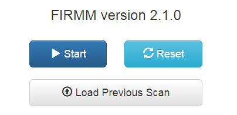

Version 2.1 written by Eric Earl (OHSU), Jon Koller (WUSM), Rachel Klein (OHSU), and Andrew Van (WUSM).  There is a FAQ section for troubleshooting common problems at the end of this document.

**NOTE**: Make sure you are logged in as the `firmmproc` user created by the install script before running FIRMM.

* If you're already using the system where FIRMM was installed, make sure to switch to the `firmmproc` account created during installation.
* If you are on a different system, `ssh -X` to the FIRMM system as `firmmproc`.

# Starting FIRMM

Typing `FIRMM` in a terminal will start FIRMM:

```
FIRMM
```

The `-t` option will allow you to run FIRMM in test mode (see FAQ):

```
FIRMM -t
```

The `-s` option will allow you to modify FIRMM's settings:

```
FIRMM -s
```

Use the `-h` option to list help:

```
FIRMM -h
```

When FIRMM starts, a web browser should open and you should see a screen like this:


<div class="page-break"></div>

# Usage

## Start Options
In the upper right of the browser, there is a set of buttons:



You can click the start button to process a current DICOM series or click the "Load previous scan button" to process an old JSON

## Loading an Current Scan
Once you press start, a list of potential folders will appear. Select the folder you want to monitor, and press "Run" to start processing

## Loading JSONs
As well as using FIRMM to display real-time scan information, you can also use it to load a visual representation of previous scans. As each scan is processed by FIRMM, information about it is written to a JSON, which is moved to `~/FIRMM/v2.1.0/django/complete_JSONs` after FIRMM stops.

You can click the "load previous scan" button to load any JSON currently in the `complete_JSONs` directory.

**Note: the JSONs created by FIRMM are stored in the `complete_JSONs` folder indefinitely unless moved by the user. As well as motion information, these JSONs contain information from the DICOM headers such as the Patient ID and Patient Name entered by the scan operator during patient registration. Users are responsible for restricting access to the JSONs created by FIRMM as appropriate.**


<div class="page-break"></div>

## FIRMM beginning monitoring


Once FIRMM has been started, it will process each sequence with `epf` and `2d1` in the series' sequence name and without `MoCo` or `PMU` in the series description.

<div class="page-break"></div>

## FIRMM in action


This is a screenshot of FIRMM in use.  Following are breakdowns of each plot and table.

<div class="page-break"></div>

# Components of FIRMM

## Graph of Framewise Displacement Over Time


This plot shows the Framewise Displacement (FD) in millimeters as a function of time in the scanner.  FD is a measure of the total movement between a pair of frames including all rotations and translations in 3D space.  The calculation assumes a head radius of 50 mm.

By default, if there are more than five minutes' worth of data, only the last five minutes are displayed for maximum readability. The toggle buttons just above the framewise displacement graph allow you to switch from displaying the last five minutes of data to displaying all data and back.

## Summary table


The summary table provides summary data on each series with information from the DICOM headers and information from FD calculations and thresholding.  These include: the Series Number, Series Description, frame (aka. DICOM) count, Repetition Time (TR), the total time acquired per series, then three entries for the "good" time based on `TR*(frame count < low, middle, and high FD thresholds)`. If the default settings file is used, these thresholds will be 0.2mm, 0.3mm, and 0.4mm, respectively. To customize them, generate a new settings file. Each new series is added to the top of the table and displayed in real time.

<div class="page-break"></div>

## Predicted Duration to Scan Criteria table


The Predicated Duration to Scan Criteria table uses the data that has been collected so far to predict how long it will take to reach criteria for the three FD thresholds.

## Collected Low Movement Frames table


The Collected Low Movement Frames table shows how much "good" time and how many "good/bad" frames have been acquired since the beginning of the scan.

## Graph of Progress to Criteria


The progress to criteria section shows how much good time has been acquired under each FD threshold. A green check mark will appear for each FD threshold when the criteria line has been met or surpassed for that threshold. The criteria time will appear at 12.5 minutes by default, but can be customized by generating a new settings file.

## Scan information


The scan information section displays information about dicom location and the patient (This example has been anonymized).
