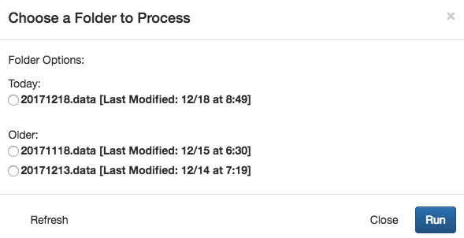

**NOTE**: Make sure you are logged in as the `firmmproc` user created by the install script before running FIRMM.

* If you're already using the system where FIRMM was installed, make sure to switch to the `firmmproc` account created during installation.
* If you are on a different system, `ssh -X` to the FIRMM system as `firmmproc`.

# Launch FIRMM

Typing `FIRMM` in a terminal will start FIRMM:

```
FIRMM
```

The `-t` option will allow you to run FIRMM in test mode (see FAQ):

```
FIRMM -t
```

Use the `-h` option to list help:

```
FIRMM -h
```

When FIRMM starts, a web browser should open and you should see a screen like this:


<div class="page-break"></div>

# Start Processing
FIRMM can be run on a current scan or on a previous scan.
In the upper right of the browser, you should see the following set of buttons:


You can click the start button to process a current DICOM series or click the "Load Previous Scan" button to load a visual representation of a previous scan.

**Loading an Current DICOM Series**

Once you press start, a list of potential folders will appear, as shown below.



The folders should be listed in chronological order, with the most recently modified folder at the top of the list. If you do not see the folder you are expecting, you can hit the "Refresh" button. This will tell FIRMM to search again for folders, so any additional folders (created after "Start" was pressed) will now show up in the list.     

Select the appropriate folder, and press the "Run" button to start processing.

**Loading a Previous JSON**

As each scan is processed by FIRMM, information about it is written to a JSON, which is moved to `~/FIRMM/v3.0.7/django/complete_JSONs` after FIRMM stops. By clicking the "Load Previous Scan" button you can load any JSON currently in the `complete_JSONs` directory.

**Note: the JSONs created by FIRMM are stored in the `complete_JSONs` folder indefinitely unless moved by the user. As well as motion information, these JSONs contain information from the DICOM headers such as the Patient ID and Patient Name entered by the scan operator during patient registration. Users are responsible for restricting access to the JSONs created by FIRMM as appropriate.**

<div class="page-break"></div>

**FIRMM beginning monitoring**


Once FIRMM has been started, it will process each sequence with `epf` and `2d1` in the series' sequence name and without `MoCo` or `PMU` in the series description.

<div class="page-break"></div>

# Components of FIRMM

**FIRMM in action**


This is a screenshot of FIRMM in use.  Following are breakdowns of each plot and table.

<div class="page-break"></div>

**Graph of Framewise Displacement Over Time**


This plot shows the Framewise Displacement (FD) in millimeters as a function of time in the scanner.  FD is a measure of the total movement between a pair of frames including all rotations and translations in 3D space.  The calculation assumes a head radius of 50 mm.

By default, if there are more than five minutes' worth of data, only the last five minutes are displayed for maximum readability. The dropdown menus just below the framewise displacement graph allow you to switch from displaying the last five minutes of data to displaying all data and back, as well as apply filtering.

**Summary table**


The summary table provides summary data on each series with information from the DICOM headers and information from FD calculations and thresholding.  These include: the Series Number, Series Description, frame (aka. DICOM) count, Repetition Time (TR), the total time acquired per series, then three entries for the "good" time based on `TR*(frame count < low, middle, and high FD thresholds)`. If the default settings are used, these thresholds will be 0.2mm, 0.3mm, and 0.4mm, respectively (see Settings section below on how to customize them). Each new series is added to the top of the table and displayed in real time.

The checkboxes to the left of each series in the summary table allow the user to de-select series that should not be included in plots and predictions.

<div class="page-break"></div>

**Predicted Duration to Scan Criteria table**


The Predicated Duration to Scan Criteria table uses the data that has been collected so far to predict how long it will take to reach criteria for the three FD thresholds.

**Collected Low Movement Frames table**


The Collected Low Movement Frames table shows how much "good" time and how many "good/bad" frames have been acquired since the beginning of the scan.

**Graph of Progress to Criteria**


The progress to criteria section shows how much good time has been acquired under each FD threshold. A green check mark will appear for each FD threshold when the criteria line has been met or surpassed for that threshold. The criteria time will appear at 12.5 minutes by default, but can be customized by generating a new settings file.

**Scan information**


The scan information section displays information about dicom location and the patient (This example has been anonymized).

# Settings

**Changing Settings**


FIRMM settings can be adjusted in the settings panel. You can access this panel by selecting the settings tab next in the FIRMM tab bar.


FIRMM currently supports the following user settings:

- FD thresholds (Low/Mid/High Thresholds)
- Criterion Time
- Brain Radius\*
- Respiratory Filter\* (Min/Max Breaths per Minute)

\*These settings are only adjustable before starting a session. For settings to apply to a running session, you must restart the session.

After changing your settings, you apply your changes by selecting the `Apply Settings` button.

**Saving/Loading Settings Profiles**

You can save your current settings with the `Save Profile` button. This will allow you to save your settings for later retrieval. **Note: You must `Apply Settings` before saving a profile in order for changes to take effect.**


Any saved settings profile can be loaded by selecting the `Load Profile` button.


