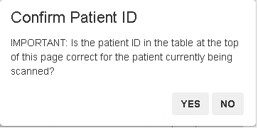

# Usage

Version 2.1 written by Eric Earl (OHSU), Jon Koller (WUSM), Rachel Klein (OHSU), and Andrew Van (WUSM).  There is a FAQ section for troubleshooting common problems at the end of this document.

**NOTE**: Make sure you are logged in as the `firmmproc` user created by the install script before running FIRMM.

* If you're already using the system where FIRMM was installed, make sure to switch to the `firmmproc` account created during installation.
* If you are on a different system, `ssh -X` to the FIRMM system as `firmmproc`.

## Starting FIRMM

Typing `FIRMM` in a terminal will start FIRMM:

```
FIRMM
```

The `-t` option will allow you to run FIRMM in test mode (see FAQ):

```
FIRMM -t
```

The `-s` option will allow you to modify FIRMM's settings:

```
FIRMM -s
```

Use the `-h` option to list help:

```
FIRMM -h
```

When FIRMM starts, a web browser should open and you should see a screen like this:


<div class="page-break"></div>

## Usage

Once open, you need to click the start button at the top right of the FIRMM GUI window to begin monitoring for DICOMs.

### FIRMM start button


### FIRMM beginning monitoring


Once FIRMM has been started, it will process each sequence with `epf` and `2d1` in the series' sequence name and without `MoCo` or `PMU` in the series description.

<div class="page-break"></div>

When FIRMM first begins processing, a dialog box will appear asking you to check that the patient ID on the FIRMM screen is correct.



If you confirm the patient ID is correct for the current session, you may continue. If the subject ID that appears on FIRMM's display is not correct for this session, you will be asked to restart FIRMM after some DICOMs have been sent for your current session.

(For more about this, see "Why does FIRMM occasionally start processing a previous session when I start it?" in the FAQ section of this document.)

### Loading JSONs

As well as using FIRMM to display real-time scan information, you can also use it to load a visual representation of previous scans. As each scan is processed by FIRMM, information about it is written to a JSON, which is moved to `~/FIRMM/v2.1.0/django/complete_JSONs` after FIRMM stops.

You can click the "load previous scan" button to load any JSON currently in the `complete_JSONs` directory.

**Note: the JSONs created by FIRMM are stored in the `complete_JSONs` folder indefinitely unless moved by the user. As well as motion information, these JSONs contain information from the DICOM headers such as the Patient ID and Patient Name entered by the scan operator during patient registration. Users are responsible for restricting access to the JSONs created by FIRMM as appropriate.**


<div class="page-break"></div>

### FIRMM in action


This is a screenshot of FIRMM in use.  Following are breakdowns of each plot and table.

<div class="page-break"></div>

## Components of FIRMM

### Graph of Framewise Displacement Over Time


This plot shows the Framewise Displacement (FD) in millimeters as a function of time in the scanner.  FD is a measure of the total movement between a pair of frames including all rotations and translations in 3D space.  The calculation assumes a head radius of 50 mm.

By default, if there are more than five minutes' worth of data, only the last five minutes are displayed for maximum readability. The toggle buttons just above the framewise displacement graph allow you to switch from displaying the last five minutes of data to displaying all data and back.

### Summary table


The summary table provides summary data on each series with information from the DICOM headers and information from FD calculations and thresholding.  These include: the Series Number, Series Description, frame (aka. DICOM) count, Repetition Time (TR), the total time acquired per series, then three entries for the "good" time based on `TR*(frame count < low, middle, and high FD thresholds)`. If the default settings file is used, these thresholds will be 0.2mm, 0.3mm, and 0.4mm, respectively. To customize them, generate a new settings file. Each new series is added to the top of the table and displayed in real time.

<div class="page-break"></div>

### Predicted Duration to Scan Criteria table


The Predicated Duration to Scan Criteria table uses the data that has been collected so far to predict how long it will take to reach criteria for the three FD thresholds.

### Collected Low Movement Frames table


The Collected Low Movement Frames table shows how much "good" time and how many "good/bad" frames have been acquired since the beginning of the scan.

### Graph of Progress to Criteria


The progress to criteria section shows how much good time has been acquired under each FD threshold. A green check mark will appear for each FD threshold when the criteria line has been met or surpassed for that threshold. The criteria time will appear at 12.5 minutes by default, but can be customized by generating a new settings file.

### Scan information


The scan information section displays information about dicom location and the patient (This example has been anonymized).

<div class="page-break"></div>

## Frequently Asked Questions (FAQ)

**Q. Does FIRMM store DICOMs?**

**A.** Any DICOMs used by FIRMM will be automatically deleted from the FIRMM computer after two days. Therefore, it is **very important** that users never count on FIRMM for long term data storage.

**Q. How do I get data from my scanner to FIRMM?**

**A.** To use FIRMM effectively, DICOMs need to be transferred as fast as possible to the incoming DICOM directory on the FIRMM host computer.

- **SIEMENS:** Set up and run `ideacmdtool` or the FIRMM start/stop shortcuts on your scanner.  Instructions for this are available in our ideacmdtool README or shortcuts README, respectively.
- **GE:** Please [email us](mailto:FIRMMsoftware@gmail.com) for help.
- **PHILIPS:** Please [email us](mailto:FIRMMsoftware@gmail.com) for help.

When the FIRMM installation script is run, it makes two Windows batch files on the FIRMM machine. They are called `FIRMM_session_start.bat` and `FIRMM_session_stop.bat`. Getting these to the scanner from the FIRMM host PC will allow SIEMENS users to use DICOM streaming start/stop shortcuts.  Read our shortcuts README for more information.

**Q. Does FIRMM work with GE or PHILIPS scanners?**

**A.** FIRMM is designed to work with any scanner as long as DICOM data can be sent to a Samba shared network directory on the FIRMM host computer.

**Q. How do I test FIRMM?**

**A.** After connecting to the FIRMM host computer via `ssh -X firmm_host` (where `firmm_host` is your FIRMM Linux system's name), run `FIRMM -t`. This will start FIRMM on the `firmm_host` computer and copy a few test DICOM series to the incoming DICOM directory specified in the settings. Remember to click **Start FIRMM** in the browser window.  FIRMM will close automatically a little after the test is finished.

**Q. How do I change the FD thresholds?**

**A.** Run `FIRMM -s` on the FIRMM host computer. This will open the settings menu.

**Q. Can I revert to a previously installed version of FIRMM if needed?**

**A.** Users can revert to a previous version of FIRMM if the minor version is the same (e.g. reverting from 2.1.1 to 2.1.0). This would normally occur only if a bugfix that was introduced within the minor version caused problems running FIRMM on the user's system.

To revert to a previous version, find the previous version of the `run.sh` file that was created by the FIRMM automatic updater. It will be stored in the same directory as your current `run.sh` and its name will contain the previous version number (e.g. `run.sh.2.1.0`). Re-save that previous file under the name `run.sh`, replacing or removing your current file. Then you can run FIRMM commands as normal and the desired version will be used.

**Q. Does FIRMM work with structural data?**

**A.** Not currently, but we plan to add this capability in an upcoming release.

**Q. Where has FIRMM been tested?**

**A.** As of the creation date of this document, FIRMM has been tested on the following systems/scanners:
- Intel Xeon E5-2640v3 (16GB RAM, HDD) with Siemens Prisma scanner
- Dell Optiplex with i5 processor (4GB RAM, HDD) with Siemens Skyra scanner
- Core i7-4790K (16GB RAM, SSD) with Siemens Prisma scanner

**Q. Why does FIRMM occasionally start processing a previous session when I start it?**

**A.** When FIRMM is launched, it looks for the latest directory in the DICOM streaming directory to process. If FIRMM is launched within 10 minutes of the conclusion of a **previous** scanning session for which DICOMs were sent to FIRMM, and no DICOMs from the **current** session have been sent yet, it will see the **previous** session as "new" and start processing it. To remedy this, close FIRMM and re-launch it **after** some DICOMs have been sent for your current session. These can be any DICOMs, e.g. localizer, AAscout, T1, etc. FIRMM will see the new folder and wait for types of scans it can process (EPI, BOLD, etc.).
